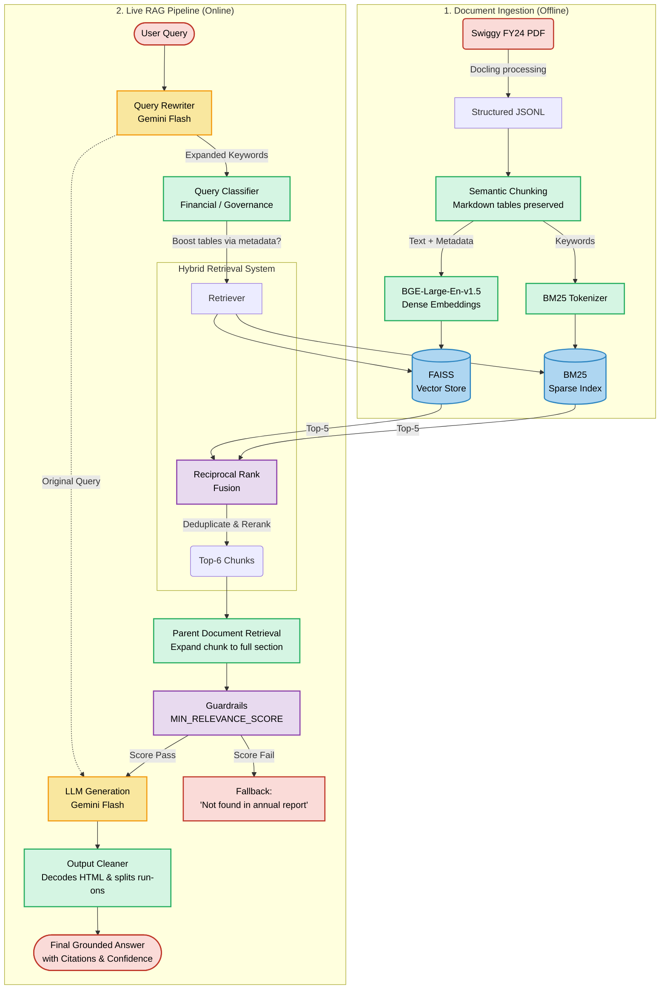

# Swiggy Annual Report RAG System

A **production-grade** Retrieval-Augmented Generation (RAG) system that answers questions strictly grounded in Swiggy's Annual Report FY24. 

This repository includes both a **CLI interface** and a **FastAPI backend** ready for frontend integration.

---



---

## 🌐 Live Demo & Source Code

- **Live App (Hugging Face Spaces)**: [https://huggingface.co/spaces/saksham-ds/swiggy_rag](https://huggingface.co/spaces/saksham-ds/swiggy_rag)
- **GitHub Repository**: [Sakshamd123/swiggy-annualreport-chatbot](https://github.com/Sakshamd123/swiggy-annualreport-chatbot)
- **Official Source**: [Swiggy Annual Report FY 2023–24 (PDF)](https://www.bseindia.com/bseplus/AnnualReport/544225/10424544225.pdf)
- **Extracted Form**: Structured JSONL (`data/swiggy_multimodal.jsonl`) generated via Docling. 
- **PDF Fallback**: The system defaults to the JSONL for 100% accurate table structures, but contains fallback logic inside `rag/ingestion/` to automatically load and parse the PDF if the JSONL is missing.

---

## 🚀 Setup & Installation

### 1. Install dependencies

```bash
pip install -r requirements.txt
```
*(Note: First run will download the BGE-large-en-v1.5 embedding model ~1.3GB).*

### 2. Environment Variables

Create a `.env` file in the root directory:

```bash
cp .env.example .env
```
Edit `.env` and add: `GOOGLE_API_KEY=your_gemini_flash_api_key_here`

### 3. Build Indices (First Run)

Before starting the API or CLI, build the persistent FAISS and BM25 indices:

```bash
python -m rag.main --index
```

---

## ⚡ Quick Start (UI & API)

Start the FastAPI server to access the modern web UI and API endpoints:

```bash
uvicorn app.main:app --host 0.0.0.0 --port 8000 --reload
```
Next, open your browser and navigate to **[http://localhost:8000](http://localhost:8000)** to use the chat interface.

### API Usage Example

The API runs at `http://localhost:8000/api/v1/query`. Automated Swagger docs are at `http://localhost:8000/docs`.

**Request:**
```bash
curl -X 'POST' \
  'http://localhost:8000/api/v1/query' \
  -H 'Content-Type: application/json' \
  -d '{
  "question": "What is the standalone net loss for Swiggy in FY24?"
}'
```

**Response:**
```json
{
  "answer": "Swiggy's standalone net loss for the year ended March 31, 2024, was ₹22,094 Million.",
  "confidence": "HIGH",
  "category": "FINANCIAL",
  "source_pages": "Pages 3-4",
  "context_snippet": "..."
}
```

---


## 💻 CLI Mode

You can also interact directly with the backend via terminal. The results will be printed directly to your console, including the answer, confidence score, and source pages.

**Interactive mode:**
```bash
python -m rag.main
```

**Single-query mode:**
```bash
python -m rag.main --query "Who are the statutory auditors?"
```

**Example CLI Output:**
```text
Question: Who are the statutory auditors?

Answer          : The statutory auditors of Swiggy Limited are Deloitte Haskins & Sells.
Confidence      : HIGH
Category        : GOVERNANCE
Source Pages    : Pages 106-107
--------------------------------------------------
```

---

## 📁 Project Structure

```text
swiggy-rag/
├── app/
│   ├── main.py              ← FastAPI application instance
│   ├── routes.py            ← API Endpoints (POST /query)
│   └── schemas.py           ← Pydantic validation models
├── data/
│   └── swiggy_multimodal.jsonl
├── rag/
│   ├── config.py            ← Global configuration / Prompts
│   ├── main.py              ← CLI Interface & Index Builder
│   ├── indexing/            ← BGE Embeddings, FAISS, BM25 Indexing
│   ├── ingestion/           ← PDF/JSONL Loaders, Chunking, Cleaning
│   ├── rag/                 ← LangChain Runnables, Guardrails, Classifiers
│   ├── retrieval/           ← Hybrid Retriever (FAISS + BM25 + RRF)
│   └── utils/               ← Shared Schemas
├── tests/
│   ├── benchmark_v2.py      ← Quality benchmarking script
│   └── (benchmark results text files)
├── vectorstore/             ← [Generated] Persistent index storage
├── .env.example
├── .gitignore
├── requirements.txt
└── README.md
```
